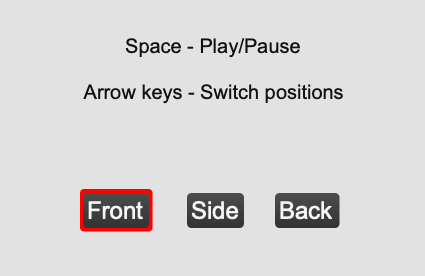
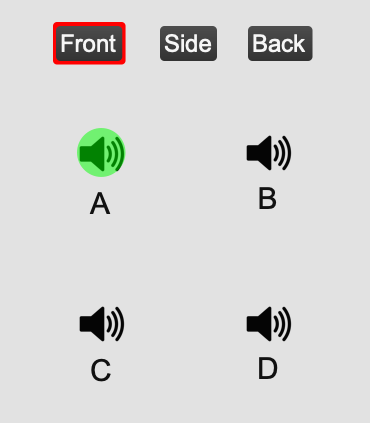

# Graphical elicitation test for the source-related width in a concert hall

Thank you for taking part in this listening test. This test aims to elicit different sub-components of the perceived spatial impression in a concert hall, in the context of multiple listening positions and head orientations.

This test will use graphical elicitation in combination with free verbal elicitation as a methodological approach.

The tools needed in order to participate in the this test are the following:

1. Max/MSP patch containing the stimuli and test interface, available at: https://github.com/bogdanbacila/SourceWidthTest/releases. Please download the latest release and follow the instructions in the README for setting up the patch.
2. The graphical interface, available at: https://scribbletogether.com/. You can download the app for either iOS or Android or alternatively, it can be used in browser. It is however recommended to be used on a platform which supports a "pen-like" input device. (e.g. Apple Pencil, etc.). You will be given an individual code at the beginning of the test in order to enter the drawing board.

## Running the listening test

### Max patch

1. Make sure you have selected your audio interface as an output device and set the sampling rate to 48kHz from the "Options -> Audio Status" menu.
2. Make sure the "Audio On/Off" button is active.
3. Type your surname in the name box. Please don't include any special characters in this field:
4. Press the "Randomize" button. This will randomize the listening positions in the test interface. Please only do this **once** at the beginning of the test. (i.e. don't press again once the test is started)

* You can now navigate through three different pages labelled "Front", "Side" and "Back". These represent the source orientation relative to the listener.

* You can now click on each listening position labelled with "A","B","C" or "D" in order to listen to the specific stimulus. Alternatively, you can use the keyboard arrows to navigate through the positions.

* Please take a moment to familiarise yourself to the test interface and to all the stimuli on all three pages.

### Scribble board.

- Go to https://scribbletogether.com/ or download the app for iPad from https://apps.apple.com/us/app/scribble-together-shared-internet-whiteboard/id1266088066#?platform=ipad.
- Click "Join board". You will have received three join codes for three different boards. Please join these three boards.
- Each board corresponds to one of the pages present in the Max test interface. (e.g. "Front" page in Max will correspond with "NAME_Front" board in Scribble)
- You will now see a blank board with a listener positioned in the middle of the page, with a letter in the middle of the head.

- You can switch between the four available sheets by clicking the layers menu in the top-right corner.

- You can select between two pen thicknesses and a colour fill mode from the top-left menu.

- You can also delete elements by either pressing the undo button or by selecting the eraser from the top menu.
- Please take some time to familiarase yourself with the graphical interface and with all the pens/fills/colour-features/erase before continuing.

## Test stages:

The test is split into 3 stages as follows:

1. **Training and initial graphical elicitation.**

  - In this stage, a meeting will be necessary for training purposes and to ensure that the test is running smoothly.

  - You will be presented with a Max patch containing all the stimuli used for comparison. ()
  - Three different pages, each one containing one orientation will be presented (i.e. front-facing, side-facing and back-facing). On each page, four stimuli will be presented in random order. You can freely switch between them, using the keyboard arrows.

* You are now requested to graphically represent your own perception of the spatial impression using your own graphical language, for each page and for each of the listening positions. In doing this you can use any of the graphical tools available on the Scribble board.(pens, colours, colour-fills).

  **While assessing the different stimuli please focus mostly on the elements of the spatial impression which define the source and the source's interaction with the room.**

  - The final part of this stage is a verbal clarification. After finishing the test,  you will take part in an follow-up interview where you will be able to verbally clarify the drawings. During this clarification stage, a set of attributes regarding the perception of the source will be extracted as well.

2. **Group discussion and graphical language development.**

    - In this stage, a focus-group will take place in a QDA-style discussion. During this discussion the elicited attributes will be discussed, and a potential consensus will be achieved regarding both the nature of the perceived attributes which define the source width and also a common graphical assessment language, to be used in the next stage.

3. **Final drawing stage**

  - In this stage you will be asked to assess the stimuli again, using the common graphical language developed in the previous stage.
